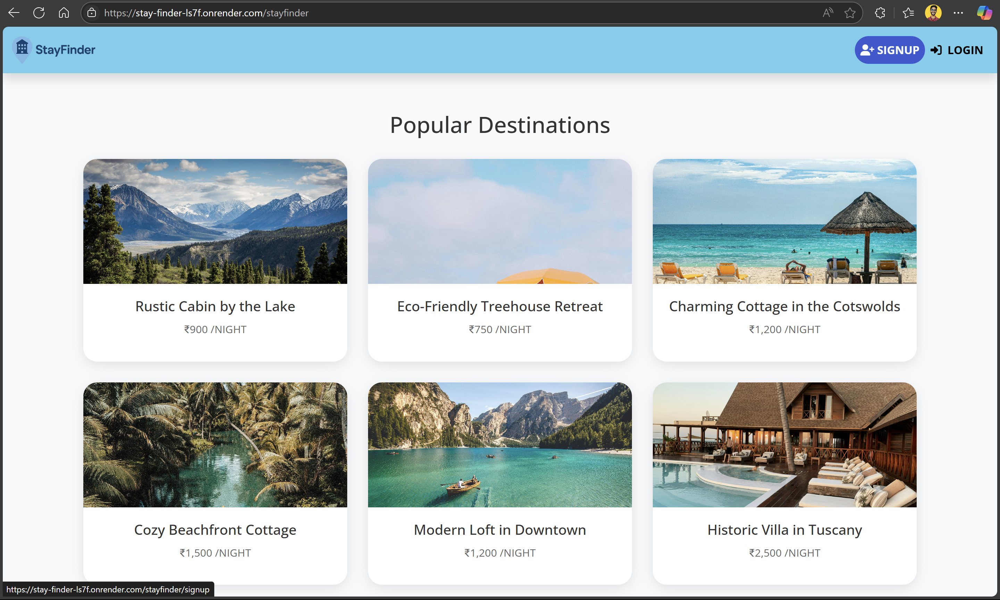

# StayFinder 🏡

StayFinder is a full-stack web application designed to help users discover and explore stunning properties across various locations. Built with the MVC architecture and powered by Node.js and Express, StayFinder integrates several modern tools and APIs to deliver a smooth and interactive user experience.

## 🖥️ Demo

You can log in to the demo version using the following credentials:

- **Demo ID:** `abc`
- **Password:** `abc`

> 🌐 [Live Demo on Render](#) *(https://stay-finder-ls7f.onrender.com)*

---

## 🧰 Tech Stack

### 👨‍💻 Frontend
- **HTML5**
- **CSS3**
- **JavaScript**
- **Bootstrap 5**

### 🔧 Backend
- **Node.js**
- **Express.js**
- **EJS** (Embedded JavaScript Templates)
- **Passport.js** – Authentication and Authorization
- **MVC Architecture**
- **REST APIs

### ☁️ APIs & Integrations
- **Cloudinary** – Image management and uploads
- **MapTiler** – Interactive maps for property locations

### 🗃️ Database
- **MySQL** – Relational data (users, bookings, etc.)
- **MongoDB (Atlas)** – Document data (property details)
  - **Mongoose** – ODM for MongoDB
  - **Mongosh & Compass** – Querying and visualization

### 🚀 Deployment
- **Render** – Full-stack deployment with environment variables

---

## 📌 Features

- 🔐 User authentication and authorization (Signup/Login with Passport.js)
- 🏘️ Browse and view various properties by category
- 📍 Map integration to visualize property locations
- 📸 Upload and manage images via Cloudinary
- 📄 MVC folder structure for maintainability and scalability
- 📱 Fully responsive UI using Bootstrap

---

## 📷 Screenshots

  
*Popular destinations display with pricing*

---

## 🏗️ Project Structure

```bash
stayfinder/
├── config/               # Configuration files (DB, passport, APIs)
├── controllers/          # Route controllers
├── models/               # Mongoose models
├── public/               # Static assets (CSS, JS, images)
├── routes/               # Express route handlers
├── views/                # EJS templates
├── .env                  # Environment variables
├── app.js                # Main server file
└── README.md             # Project documentation
